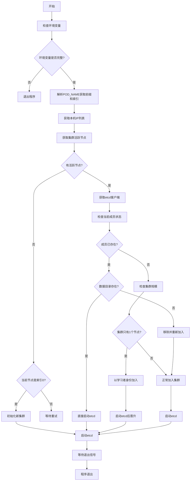

# etcd-cluster 自启动工具

## 概述

这是一个用于在 Kubernetes 环境中自动启动和管理 etcd 集群的工具。它能够根据当前集群状态自动决定是初始化新集群、加入现有集群，还是以学习者（learner）身份加入，并确保集群的高可用性和数据一致性。

## 核心功能

### 1. 集群状态检测
- 通过 Kubernetes API 或 DNS 解析发现其他 etcd 节点
- 使用健康检查（/readyz 端点）判断节点状态
- 区分活跃节点和死亡节点

### 2. 智能启动决策
- **场景 1：无活跃节点** - 第一个节点（索引 0）初始化新集群
- **场景 2：有活跃节点** - 其他节点加入现有集群
- **场景 3：单主节点** - 以学习者身份加入然后升级为正式成员

### 3. 故障恢复机制
- 自动移除死亡节点
- 重新加入数据丢失的成员
- 学习者自动晋升

## 环境变量要求

### 必需环境变量
| 变量名 | 说明 |
|--------|------|
| `SERVICE_NAME` | Kubernetes 服务名称 |
| `MAX` | 集群最大节点数 |
| `NODEIP_DIR` | 节点 IP 文件目录 |
| `POD_NAME` | Pod 名称（格式：`prefix-index`） |
| `POD_NAMESPACE` | Pod 所在命名空间 |
| `POD_IPS` | Pod 的 IP 地址列表（逗号分隔） |
| `ETCDCTL_CACERT` | etcd CA 证书路径 |
| `ETCDCTL_CERT` | etcd 客户端证书路径 |
| `ETCDCTL_KEY` | etcd 客户端密钥路径 |
| `ETCD_DATA_DIR` | etcd 数据目录 |
| `CLIENT_PORT` | etcd 客户端端口 |
| `PEER_PORT` | etcd 对等端口 |

### 可选环境变量
| 变量名 | 说明 |
|--------|------|
| `LABELS` | 用于筛选 Pod 的标签选择器 |

## 工作流程

## 详细流程说明

### 1. 初始化阶段
1. **环境验证**：检查所有必需环境变量
2. **身份识别**：从 `POD_NAME` 解析节点前缀和索引号
3. **IP 获取**：从 `POD_IPS` 获取本机 IP 列表

### 2. 集群发现阶段
1. **Kubernetes 发现**（优先）：使用 Kubernetes API 获取 Pod IP
2. **DNS 回退**：如果 Kubernetes API 失败，通过 DNS 解析
3. **IP 文件读取**：从 `NODEIP_DIR` 读取实际节点 IP
4. **健康检查**：对每个节点进行 `/readyz` 端点检查

### 3. 启动决策阶段

#### 情况 A：无活跃节点
- 只有索引为 0 的节点可以初始化新集群
- 其他节点等待并重试

#### 情况 B：有活跃节点
1. **成员状态检查**：
   - 如果成员已存在且数据完整：直接启动
   - 如果成员已存在但数据丢失：移除后重新加入
   - 如果成员不存在：作为新成员加入

2. **加入策略**：
   - **单节点集群**：以学习者身份加入，启动后晋升为正式成员
   - **多节点集群**：正常加入
   - **仲裁保护**：确保不会只剩一个非学习者节点

### 4. etcd 启动阶段
1. **环境变量设置**：
   - `ETCD_INITIAL_CLUSTER_STATE`: "new" 或 "existing"
   - `ETCD_INITIAL_CLUSTER`: 集群成员列表
2. **数据目录清理**：确保干净的数据目录
3. **进程启动**：启动 etcd 进程

### 5. 监控与退出
1. **信号处理**：捕获 SIGINT/SIGTERM 信号
2. **进程监控**：监控 etcd 进程状态
3. **优雅退出**：收到信号时终止 etcd 进程

## 特殊处理逻辑

### 学习者晋升
当集群只有一个节点时，新节点先以学习者身份加入，启动 etcd 后立即晋升为正式成员，避免单点故障期间的仲裁丢失。

### 死亡节点清理
检测到在 Kubernetes/DNS 中不存在但仍在 etcd 集群中的成员时，自动将其移除。

### 数据一致性保证
如果成员存在于集群中但本地数据目录丢失，工具会先移除该成员，然后以新成员身份重新加入，确保数据一致性。

## 日志输出

工具使用结构化日志，关键信息包括：
- 环境变量配置
- 发现的活跃/死亡节点
- 集群决策原因
- etcd 启动参数
- 进程状态变化

## 部署建议

1. **StatefulSet 部署**：确保稳定的网络标识和存储
2. **资源限制**：为 etcd 配置足够的内存和 CPU
3. **存储配置**：使用持久化存储确保数据安全
4. **网络策略**：限制对 etcd 端点的访问
5. **监控告警**：监控 etcd 集群健康状态

## 故障排查

### 常见问题
1. **无法加入集群**：检查网络连通性和证书配置
2. **仲裁丢失**：确保不会同时重启过多节点
3. **数据不一致**：检查存储配置和备份策略

### 日志关键词
- "Failed to get alive endpoints"：集群发现失败
- "non learner is 1"：仲裁保护触发
- "member is dead but in cluster"：死亡节点清理
- "promote member success"：学习者晋升成功

## 安全性考虑

1. **TLS 加密**：所有 etcd 通信使用 TLS
2. **证书管理**：定期更新客户端证书
3. **网络隔离**：限制对 etcd 端点的访问
4. **权限控制**：使用最小权限原则配置服务账户
