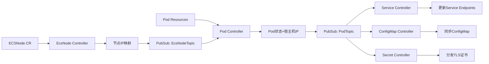
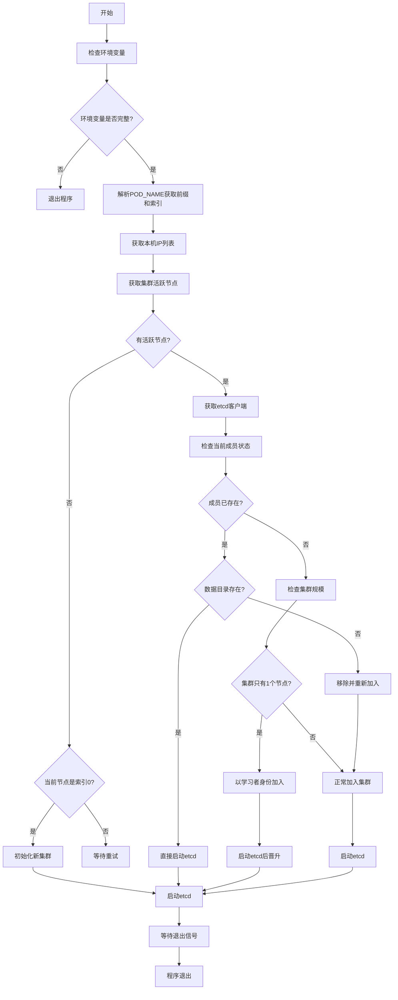

# etcd-cluster 自启动工具

## 概述

这是一个用于在 Kubernetes 环境中自动启动和管理 etcd 集群的工具套件，包含两个核心组件：

1. **etcdcluster**：etcd 集群自动启动 sidecar，负责 etcd 进程的智能启动和集群管理
2. **etcdnode**：Kubernetes 控制器，负责节点网络信息同步和资源协调

这两个组件协同工作，实现 etcd 集群的全自动化部署和管理，确保集群的高可用性和数据一致性。

## 组件架构

### etcdcluster（Sidecar 容器）

etcd 集群自动启动 sidecar，作为 etcd StatefulSet 的 sidecar 容器运行，负责：

#### 核心功能

1. **集群状态检测**
   - 通过 Kubernetes API 或 DNS 解析发现其他 etcd 节点
   - 使用健康检查（/readyz 端点）判断节点状态
   - 区分活跃节点和死亡节点

2. **智能启动决策**
   - **场景 1：无活跃节点** - 第一个节点（索引 0）初始化新集群
   - **场景 2：有活跃节点** - 其他节点加入现有集群
   - **场景 3：单主节点** - 以学习者身份加入然后升级为正式成员

3. **故障恢复机制**
   - 自动移除死亡节点
   - 重新加入数据丢失的成员
   - 学习者自动晋升

### etcdnode（Kubernetes 控制器）

Kubernetes 原生控制器，负责节点网络信息同步和资源协调，为 etcd 集群提供动态网络配置支持。

#### 核心功能

1. **节点网络信息管理**
   - 监听 `ECSNode` 自定义资源，获取节点的多网卡 IP 信息
   - 根据配置的网络接口（`interfaces`）过滤和收集节点 IP
   - 识别主接口（`masterif`）作为节点的主 IP
   - 维护节点主 IP 到所有 IP 的映射关系

2. **Pod 状态跟踪**
   - 监听指定命名空间和标签的 Pod 资源
   - 跟踪 Pod 的就绪状态（Ready）和宿主机 IP
   - 订阅 EcsNode 更新，维护 Pod 宿主机到节点 IP 的映射
   - 通过 PubSub 发布 Pod 状态变化事件

3. **资源同步控制器**（可选）
   - **Service 同步**：根据 Pod 状态更新 Service 的 Endpoints
   - **ConfigMap 同步**：响应 Pod 状态变化同步 ConfigMap
   - **Secret 同步**：自动生成和分发 TLS 证书到多个命名空间

4. **事件驱动架构**
   - 使用 PubSub 模式实现控制器间解耦通信
   - EcsNode 控制器发布节点 IP 映射到 `EcsNodeTopic`
   - Pod 控制器订阅 `EcsNodeTopic`，发布 Pod 状态到 `PodTopic`
   - Service/ConfigMap/Secret 控制器订阅 `PodTopic` 进行同步

#### 配置结构

```yaml
# EcsNode 配置
ecsnode:
  interfaces: ["eth0", "eth1"]  # 要跟踪的网络接口列表
  masterif: "eth0"               # 主接口，用于确定节点主 IP
  namespace: "default"           # ECSNode 资源所在命名空间

# Pod 配置
pod:
  labels:                        # Pod 标签选择器
    app: etcd
  namespace: "default"           # 监听的 Pod 命名空间

# Service 同步配置（可选）
service:
  name: "etcd-service"           # 要同步的 Service 名称
  namespace: "default"

# ConfigMap 同步配置（可选）
configmap:
  name: "etcd-config"            # 要同步的 ConfigMap 名称
  namespace: "default"

# 证书管理配置（可选）
cert:
  enabled: true                  # 是否启用证书管理
  ca_secret_name: "etcd-ca"      # CA 证书 Secret 名称
  ca_secret_namespace: "default" # CA Secret 所在命名空间
  client_secret_namespaces:      # 客户端证书分发的命名空间列表
    - "default"
    - "kube-system"
```

#### 工作流程


```mermaid
graph LR
    A[ECSNode CR] --> B[EcsNode Controller]
    B --> C[节点IP映射]
    C --> D[PubSub: EcsNodeTopic]

    E[Pod Resources] --> F[Pod Controller]
    D --> F
    F --> G[Pod状态+宿主机IP]
    G --> H[PubSub: PodTopic]

    H --> I[Service Controller]
    H --> J[ConfigMap Controller]
    H --> K[Secret Controller]

    I --> L[更新Service Endpoints]
    J --> M[同步ConfigMap]
    K --> N[分发TLS证书]
```

#### 部署要求

1. **环境变量**
   - `NAMESPACE`：控制器运行的命名空间（必需）

2. **RBAC 权限**
   - 读取 ECSNode 自定义资源
   - 读写 Pod、Service、ConfigMap、Secret 资源
   - Leader Election 权限

3. **自定义资源定义**
   - 需要预先创建 `ECSNode` CRD
   - CRD 定义在 `pkg/apis/v1/types_ecsnode.go`

#### 与 etcdcluster 的集成

etcdnode 控制器为 etcdcluster sidecar 提供关键的网络信息：

1. **节点 IP 文件生成**：将节点 IP 映射写入 `NODEIP_DIR` 目录
2. **多网卡支持**：etcd 可以绑定到节点的多个 IP 地址
3. **动态发现**：etcdcluster 读取这些文件获取集群成员的实际 IP 地址
4. **证书分发**：自动生成和更新 etcd 所需的 TLS 证书

## etcdcluster 环境变量要求

### 必需环境变量
| 变量名 | 说明 |
|--------|------|
| `SERVICE_NAME` | Kubernetes 服务名称 |
| `MAX` | 集群最大节点数 |
| `NODEIP_DIR` | 节点 IP 文件目录 |
| `POD_NAME` | Pod 名称（格式：`prefix-index`） |
| `POD_NAMESPACE` | Pod 所在命名空间 |
| `POD_IPS` | Pod 的 IP 地址列表（逗号分隔） |
| `ETCDCTL_CACERT` | etcd CA 证书路径 |
| `ETCDCTL_CERT` | etcd 客户端证书路径 |
| `ETCDCTL_KEY` | etcd 客户端密钥路径 |
| `ETCD_DATA_DIR` | etcd 数据目录 |
| `CLIENT_PORT` | etcd 客户端端口 |
| `PEER_PORT` | etcd 对等端口 |

### 可选环境变量
| 变量名 | 说明 |
|--------|------|
| `LABELS` | 用于筛选 Pod 的标签选择器 |

## 工作流程


```mermaid
graph TD
    A[开始] --> B[检查环境变量]
    B --> C{环境变量是否完整?}
    C -->|否| D[退出程序]
    C -->|是| E[解析POD_NAME获取前缀和索引]
    E --> F[获取本机IP列表]
    F --> G[获取集群活跃节点]
    
    G --> H{有活跃节点?}
    H -->|否| I{当前节点是索引0?}
    I -->|是| J[初始化新集群]
    I -->|否| K[等待重试]
    
    H -->|是| L[获取etcd客户端]
    L --> M[检查当前成员状态]
    
    M --> N{成员已存在?}
    N -->|是| O{数据目录存在?}
    O -->|是| P[直接启动etcd]
    O -->|否| Q[移除并重新加入]
    
    N -->|否| R[检查集群规模]
    
    R --> S{集群只有1个节点?}
    S -->|是| T[以学习者身份加入]
    T --> U[启动etcd后晋升]
    S -->|否| V[正常加入集群]
    
    V --> W[启动etcd]
    
    J --> X[启动etcd]
    P --> X
    Q --> V
    U --> X
    W --> X
    
    X --> Y[等待退出信号]
    Y --> Z[程序退出]
```

## 详细流程说明

### 1. 初始化阶段
1. **环境验证**：检查所有必需环境变量
2. **身份识别**：从 `POD_NAME` 解析节点前缀和索引号
3. **IP 获取**：从 `POD_IPS` 获取本机 IP 列表

### 2. 集群发现阶段
1. **Kubernetes 发现**（优先）：使用 Kubernetes API 获取 Pod IP
2. **DNS 回退**：如果 Kubernetes API 失败，通过 DNS 解析
3. **IP 文件读取**：从 `NODEIP_DIR` 读取实际节点 IP
4. **健康检查**：对每个节点进行 `/readyz` 端点检查

### 3. 启动决策阶段

#### 情况 A：无活跃节点
- 只有索引为 0 的节点可以初始化新集群
- 其他节点等待并重试

#### 情况 B：有活跃节点
1. **成员状态检查**：
   - 如果成员已存在且数据完整：直接启动
   - 如果成员已存在但数据丢失：移除后重新加入
   - 如果成员不存在：作为新成员加入

2. **加入策略**：
   - **单节点集群**：以学习者身份加入，启动后晋升为正式成员
   - **多节点集群**：正常加入
   - **仲裁保护**：确保不会只剩一个非学习者节点

### 4. etcd 启动阶段
1. **环境变量设置**：
   - `ETCD_INITIAL_CLUSTER_STATE`: "new" 或 "existing"
   - `ETCD_INITIAL_CLUSTER`: 集群成员列表
2. **数据目录清理**：确保干净的数据目录
3. **进程启动**：启动 etcd 进程

### 5. 监控与退出
1. **信号处理**：捕获 SIGINT/SIGTERM 信号
2. **进程监控**：监控 etcd 进程状态
3. **优雅退出**：收到信号时终止 etcd 进程

## 特殊处理逻辑

### 学习者晋升
当集群只有一个节点时，新节点先以学习者身份加入，启动 etcd 后立即晋升为正式成员，避免单点故障期间的仲裁丢失。

### 死亡节点清理
检测到在 Kubernetes/DNS 中不存在但仍在 etcd 集群中的成员时，自动将其移除。

### 数据一致性保证
如果成员存在于集群中但本地数据目录丢失，工具会先移除该成员，然后以新成员身份重新加入，确保数据一致性。

## 日志输出

工具使用结构化日志，关键信息包括：
- 环境变量配置
- 发现的活跃/死亡节点
- 集群决策原因
- etcd 启动参数
- 进程状态变化

## 部署建议

1. **StatefulSet 部署**：确保稳定的网络标识和存储
2. **资源限制**：为 etcd 配置足够的内存和 CPU
3. **存储配置**：使用持久化存储确保数据安全
4. **网络策略**：限制对 etcd 端点的访问
5. **监控告警**：监控 etcd 集群健康状态

## 故障排查

### 常见问题
1. **无法加入集群**：检查网络连通性和证书配置
2. **仲裁丢失**：确保不会同时重启过多节点
3. **数据不一致**：检查存储配置和备份策略

### 日志关键词
- "Failed to get alive endpoints"：集群发现失败
- "non learner is 1"：仲裁保护触发
- "member is dead but in cluster"：死亡节点清理
- "promote member success"：学习者晋升成功

## 安全性考虑

1. **TLS 加密**：所有 etcd 通信使用 TLS
2. **证书管理**：定期更新客户端证书
3. **网络隔离**：限制对 etcd 端点的访问
4. **权限控制**：使用最小权限原则配置服务账户
